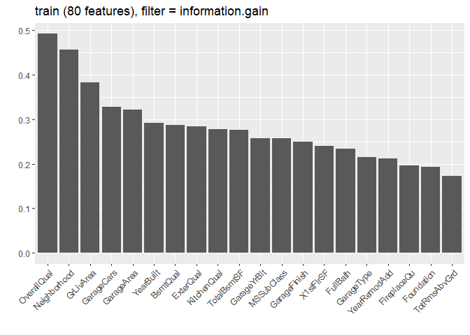
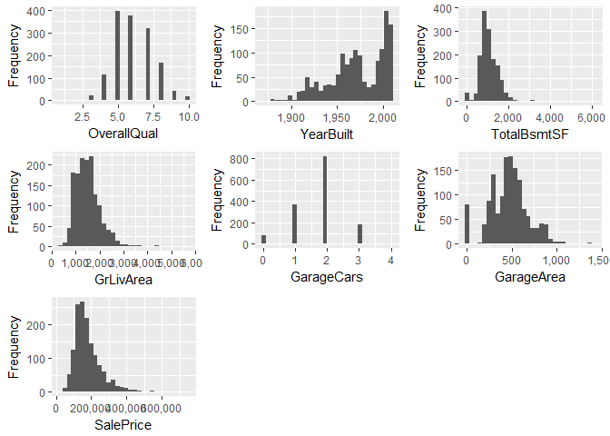
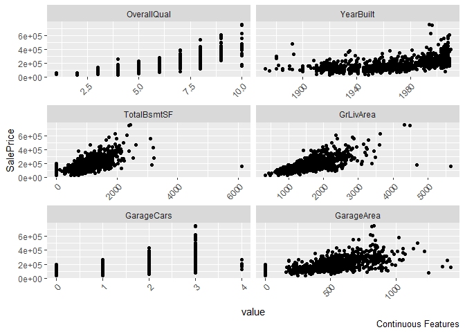
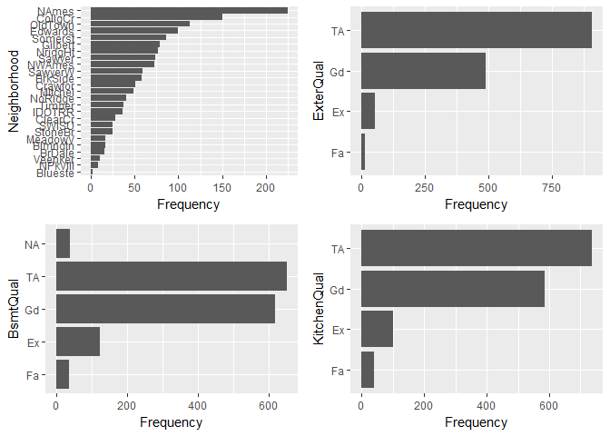
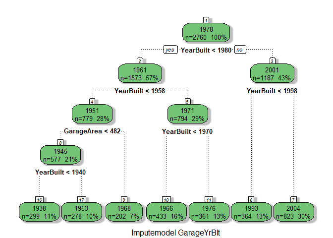
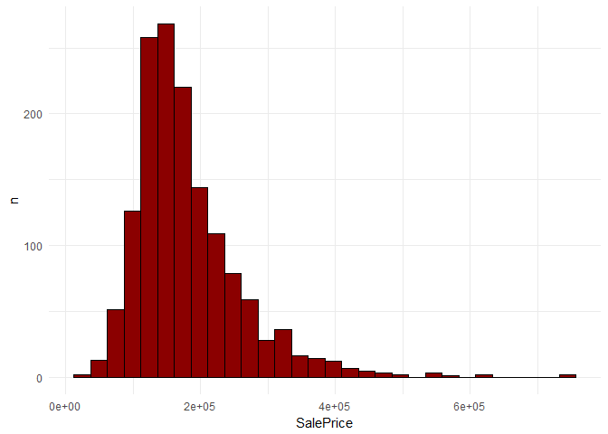
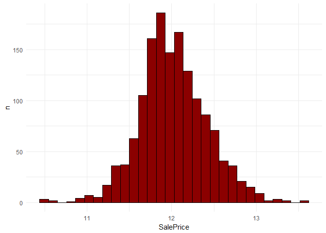
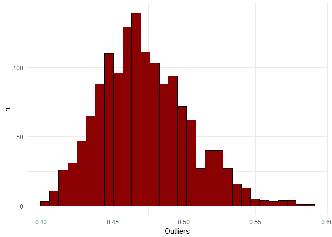
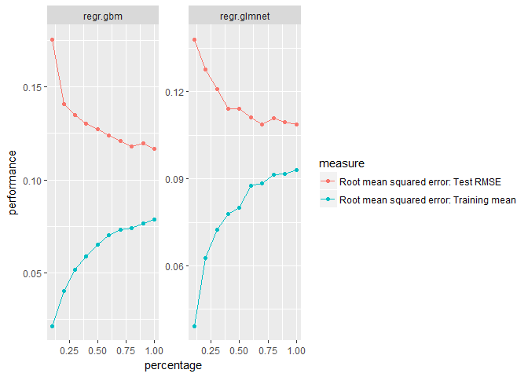
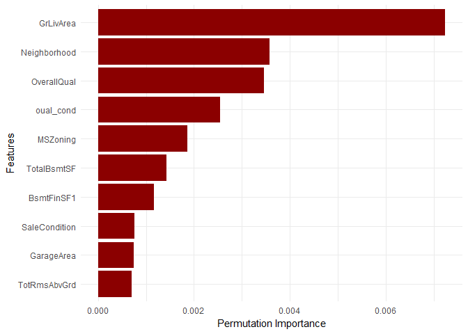

#### Used Packages

    library(mlrMBO)
    library(mlr)
    library(parallel)
    library(parallelMap) 
    library(rpart)
    library(rpart.plot)
    library(rattle)
    library(ggplot2)
    library(dplyr)
    library(tidyr)
    library(knitr)
    library(tibble)
    library(isofor)
    library(reshape)
    library(DataExplorer)

1. Introduction
---------------

-   This notebook is a solution of the "House Prices: Advanced
    Regression Techniques" competition from Kaggle.com
    (<https://www.kaggle.com/c/house-prices-advanced-regression-techniques>).  
-   The goal is to predict the final sales price of a home. The
    competition is based on 79 variables describing different aspects of
    residential homes in Ames and Iowa (the detailed description of the
    variables can be found here:
    <https://www.kaggle.com/c/house-prices-advanced-regression-techniques/data>).
-   The final model scored a RMSLE (root mean squared logarithmic error)
    of 0.11871 which was in 10 % of the leaderboard at the time.

2. Reading data
---------------

-   Reading the data.
-   Creating the target column for the test set.
-   Merging the train and test set.

<!-- -->

    train = read.csv("../House Prices/train.csv", header=TRUE, na.strings=c("", "NA"))

    test = read.csv("../House Prices/test.csv", header=TRUE, na.strings=c("", "NA"))

    test$SalePrice = 0

    full = merge(train, test, all = T)

2. Data exploration
-------------------

-   Getting an initial overview.

<!-- -->

    glimpse(full)

    ## Observations: 2,919
    ## Variables: 81
    ## $ Id            <int> 1, 2, 3, 4, 5, 6, 7, 8, 9, 10, 11, 12, 13, 14, 15, 16, 17, 18, 19, 20, 21...
    ## $ MSSubClass    <int> 60, 20, 60, 70, 60, 50, 20, 60, 50, 190, 20, 60, 20, 20, 20, 45, 20, 90, ...
    ## $ MSZoning      <fct> RL, RL, RL, RL, RL, RL, RL, RL, RM, RL, RL, RL, RL, RL, RL, RM, RL, RL, R...
    ## $ LotFrontage   <int> 65, 80, 68, 60, 84, 85, 75, NA, 51, 50, 70, 85, NA, 91, NA, 51, NA, 72, 6...
    ## $ LotArea       <int> 8450, 9600, 11250, 9550, 14260, 14115, 10084, 10382, 6120, 7420, 11200, 1...
    ## $ Street        <fct> Pave, Pave, Pave, Pave, Pave, Pave, Pave, Pave, Pave, Pave, Pave, Pave, P...
    ## $ Alley         <fct> NA, NA, NA, NA, NA, NA, NA, NA, NA, NA, NA, NA, NA, NA, NA, NA, NA, NA, N...
    ## $ LotShape      <fct> Reg, Reg, IR1, IR1, IR1, IR1, Reg, IR1, Reg, Reg, Reg, IR1, IR2, IR1, IR1...
    ## $ LandContour   <fct> Lvl, Lvl, Lvl, Lvl, Lvl, Lvl, Lvl, Lvl, Lvl, Lvl, Lvl, Lvl, Lvl, Lvl, Lvl...
    ## $ Utilities     <fct> AllPub, AllPub, AllPub, AllPub, AllPub, AllPub, AllPub, AllPub, AllPub, A...
    ## $ LotConfig     <fct> Inside, FR2, Inside, Corner, FR2, Inside, Inside, Corner, Inside, Corner,...
    ## $ LandSlope     <fct> Gtl, Gtl, Gtl, Gtl, Gtl, Gtl, Gtl, Gtl, Gtl, Gtl, Gtl, Gtl, Gtl, Gtl, Gtl...
    ## $ Neighborhood  <fct> CollgCr, Veenker, CollgCr, Crawfor, NoRidge, Mitchel, Somerst, NWAmes, Ol...
    ## $ Condition1    <fct> Norm, Feedr, Norm, Norm, Norm, Norm, Norm, PosN, Artery, Artery, Norm, No...
    ## $ Condition2    <fct> Norm, Norm, Norm, Norm, Norm, Norm, Norm, Norm, Norm, Artery, Norm, Norm,...
    ## $ BldgType      <fct> 1Fam, 1Fam, 1Fam, 1Fam, 1Fam, 1Fam, 1Fam, 1Fam, 1Fam, 2fmCon, 1Fam, 1Fam,...
    ## $ HouseStyle    <fct> 2Story, 1Story, 2Story, 2Story, 2Story, 1.5Fin, 1Story, 2Story, 1.5Fin, 1...
    ## $ OverallQual   <int> 7, 6, 7, 7, 8, 5, 8, 7, 7, 5, 5, 9, 5, 7, 6, 7, 6, 4, 5, 5, 8, 7, 8, 5, 5...
    ## $ OverallCond   <int> 5, 8, 5, 5, 5, 5, 5, 6, 5, 6, 5, 5, 6, 5, 5, 8, 7, 5, 5, 6, 5, 7, 5, 7, 8...
    ## $ YearBuilt     <int> 2003, 1976, 2001, 1915, 2000, 1993, 2004, 1973, 1931, 1939, 1965, 2005, 1...
    ## $ YearRemodAdd  <int> 2003, 1976, 2002, 1970, 2000, 1995, 2005, 1973, 1950, 1950, 1965, 2006, 1...
    ## $ RoofStyle     <fct> Gable, Gable, Gable, Gable, Gable, Gable, Gable, Gable, Gable, Gable, Hip...
    ## $ RoofMatl      <fct> CompShg, CompShg, CompShg, CompShg, CompShg, CompShg, CompShg, CompShg, C...
    ## $ Exterior1st   <fct> VinylSd, MetalSd, VinylSd, Wd Sdng, VinylSd, VinylSd, VinylSd, HdBoard, B...
    ## $ Exterior2nd   <fct> VinylSd, MetalSd, VinylSd, Wd Shng, VinylSd, VinylSd, VinylSd, HdBoard, W...
    ## $ MasVnrType    <fct> BrkFace, None, BrkFace, None, BrkFace, None, Stone, Stone, None, None, No...
    ## $ MasVnrArea    <int> 196, 0, 162, 0, 350, 0, 186, 240, 0, 0, 0, 286, 0, 306, 212, 0, 180, 0, 0...
    ## $ ExterQual     <fct> Gd, TA, Gd, TA, Gd, TA, Gd, TA, TA, TA, TA, Ex, TA, Gd, TA, TA, TA, TA, T...
    ## $ ExterCond     <fct> TA, TA, TA, TA, TA, TA, TA, TA, TA, TA, TA, TA, TA, TA, TA, TA, TA, TA, T...
    ## $ Foundation    <fct> PConc, CBlock, PConc, BrkTil, PConc, Wood, PConc, CBlock, BrkTil, BrkTil,...
    ## $ BsmtQual      <fct> Gd, Gd, Gd, TA, Gd, Gd, Ex, Gd, TA, TA, TA, Ex, TA, Gd, TA, TA, TA, NA, T...
    ## $ BsmtCond      <fct> TA, TA, TA, Gd, TA, TA, TA, TA, TA, TA, TA, TA, TA, TA, TA, TA, TA, NA, T...
    ## $ BsmtExposure  <fct> No, Gd, Mn, No, Av, No, Av, Mn, No, No, No, No, No, Av, No, No, No, NA, N...
    ## $ BsmtFinType1  <fct> GLQ, ALQ, GLQ, ALQ, GLQ, GLQ, GLQ, ALQ, Unf, GLQ, Rec, GLQ, ALQ, Unf, BLQ...
    ## $ BsmtFinSF1    <int> 706, 978, 486, 216, 655, 732, 1369, 859, 0, 851, 906, 998, 737, 0, 733, 0...
    ## $ BsmtFinType2  <fct> Unf, Unf, Unf, Unf, Unf, Unf, Unf, BLQ, Unf, Unf, Unf, Unf, Unf, Unf, Unf...
    ## $ BsmtFinSF2    <int> 0, 0, 0, 0, 0, 0, 0, 32, 0, 0, 0, 0, 0, 0, 0, 0, 0, 0, 0, 0, 0, 0, 0, 0, ...
    ## $ BsmtUnfSF     <int> 150, 284, 434, 540, 490, 64, 317, 216, 952, 140, 134, 177, 175, 1494, 520...
    ## $ TotalBsmtSF   <int> 856, 1262, 920, 756, 1145, 796, 1686, 1107, 952, 991, 1040, 1175, 912, 14...
    ## $ Heating       <fct> GasA, GasA, GasA, GasA, GasA, GasA, GasA, GasA, GasA, GasA, GasA, GasA, G...
    ## $ HeatingQC     <fct> Ex, Ex, Ex, Gd, Ex, Ex, Ex, Ex, Gd, Ex, Ex, Ex, TA, Ex, TA, Ex, Ex, TA, E...
    ## $ CentralAir    <fct> Y, Y, Y, Y, Y, Y, Y, Y, Y, Y, Y, Y, Y, Y, Y, Y, Y, Y, Y, Y, Y, Y, Y, Y, Y...
    ## $ Electrical    <fct> SBrkr, SBrkr, SBrkr, SBrkr, SBrkr, SBrkr, SBrkr, SBrkr, FuseF, SBrkr, SBr...
    ## $ X1stFlrSF     <int> 856, 1262, 920, 961, 1145, 796, 1694, 1107, 1022, 1077, 1040, 1182, 912, ...
    ## $ X2ndFlrSF     <int> 854, 0, 866, 756, 1053, 566, 0, 983, 752, 0, 0, 1142, 0, 0, 0, 0, 0, 0, 0...
    ## $ LowQualFinSF  <int> 0, 0, 0, 0, 0, 0, 0, 0, 0, 0, 0, 0, 0, 0, 0, 0, 0, 0, 0, 0, 0, 0, 0, 0, 0...
    ## $ GrLivArea     <int> 1710, 1262, 1786, 1717, 2198, 1362, 1694, 2090, 1774, 1077, 1040, 2324, 9...
    ## $ BsmtFullBath  <int> 1, 0, 1, 1, 1, 1, 1, 1, 0, 1, 1, 1, 1, 0, 1, 0, 1, 0, 1, 0, 0, 0, 0, 1, 1...
    ## $ BsmtHalfBath  <int> 0, 1, 0, 0, 0, 0, 0, 0, 0, 0, 0, 0, 0, 0, 0, 0, 0, 0, 0, 0, 0, 0, 0, 0, 0...
    ## $ FullBath      <int> 2, 2, 2, 1, 2, 1, 2, 2, 2, 1, 1, 3, 1, 2, 1, 1, 1, 2, 1, 1, 3, 1, 2, 1, 1...
    ## $ HalfBath      <int> 1, 0, 1, 0, 1, 1, 0, 1, 0, 0, 0, 0, 0, 0, 1, 0, 0, 0, 1, 0, 1, 0, 0, 0, 0...
    ## $ BedroomAbvGr  <int> 3, 3, 3, 3, 4, 1, 3, 3, 2, 2, 3, 4, 2, 3, 2, 2, 2, 2, 3, 3, 4, 3, 3, 3, 3...
    ## $ KitchenAbvGr  <int> 1, 1, 1, 1, 1, 1, 1, 1, 2, 2, 1, 1, 1, 1, 1, 1, 1, 2, 1, 1, 1, 1, 1, 1, 1...
    ## $ KitchenQual   <fct> Gd, TA, Gd, Gd, Gd, TA, Gd, TA, TA, TA, TA, Ex, TA, Gd, TA, TA, TA, TA, G...
    ## $ TotRmsAbvGrd  <int> 8, 6, 6, 7, 9, 5, 7, 7, 8, 5, 5, 11, 4, 7, 5, 5, 5, 6, 6, 6, 9, 6, 7, 6, ...
    ## $ Functional    <fct> Typ, Typ, Typ, Typ, Typ, Typ, Typ, Typ, Min1, Typ, Typ, Typ, Typ, Typ, Ty...
    ## $ Fireplaces    <int> 0, 1, 1, 1, 1, 0, 1, 2, 2, 2, 0, 2, 0, 1, 1, 0, 1, 0, 0, 0, 1, 1, 1, 1, 1...
    ## $ FireplaceQu   <fct> NA, TA, TA, Gd, TA, NA, Gd, TA, TA, TA, NA, Gd, NA, Gd, Fa, NA, TA, NA, N...
    ## $ GarageType    <fct> Attchd, Attchd, Attchd, Detchd, Attchd, Attchd, Attchd, Attchd, Detchd, A...
    ## $ GarageYrBlt   <int> 2003, 1976, 2001, 1998, 2000, 1993, 2004, 1973, 1931, 1939, 1965, 2005, 1...
    ## $ GarageFinish  <fct> RFn, RFn, RFn, Unf, RFn, Unf, RFn, RFn, Unf, RFn, Unf, Fin, Unf, RFn, RFn...
    ## $ GarageCars    <int> 2, 2, 2, 3, 3, 2, 2, 2, 2, 1, 1, 3, 1, 3, 1, 2, 2, 2, 2, 1, 3, 1, 2, 2, 1...
    ## $ GarageArea    <int> 548, 460, 608, 642, 836, 480, 636, 484, 468, 205, 384, 736, 352, 840, 352...
    ## $ GarageQual    <fct> TA, TA, TA, TA, TA, TA, TA, TA, Fa, Gd, TA, TA, TA, TA, TA, TA, TA, TA, T...
    ## $ GarageCond    <fct> TA, TA, TA, TA, TA, TA, TA, TA, TA, TA, TA, TA, TA, TA, TA, TA, TA, TA, T...
    ## $ PavedDrive    <fct> Y, Y, Y, Y, Y, Y, Y, Y, Y, Y, Y, Y, Y, Y, Y, Y, Y, Y, Y, Y, Y, N, Y, Y, Y...
    ## $ WoodDeckSF    <int> 0, 298, 0, 0, 192, 40, 255, 235, 90, 0, 0, 147, 140, 160, 0, 48, 0, 0, 0,...
    ## $ OpenPorchSF   <int> 61, 0, 42, 35, 84, 30, 57, 204, 0, 4, 0, 21, 0, 33, 213, 112, 0, 0, 102, ...
    ## $ EnclosedPorch <int> 0, 0, 0, 272, 0, 0, 0, 228, 205, 0, 0, 0, 0, 0, 176, 0, 0, 0, 0, 0, 0, 20...
    ## $ X3SsnPorch    <int> 0, 0, 0, 0, 0, 320, 0, 0, 0, 0, 0, 0, 0, 0, 0, 0, 0, 0, 0, 0, 0, 0, 0, 0,...
    ## $ ScreenPorch   <int> 0, 0, 0, 0, 0, 0, 0, 0, 0, 0, 0, 0, 176, 0, 0, 0, 0, 0, 0, 0, 0, 0, 0, 0,...
    ## $ PoolArea      <int> 0, 0, 0, 0, 0, 0, 0, 0, 0, 0, 0, 0, 0, 0, 0, 0, 0, 0, 0, 0, 0, 0, 0, 0, 0...
    ## $ PoolQC        <fct> NA, NA, NA, NA, NA, NA, NA, NA, NA, NA, NA, NA, NA, NA, NA, NA, NA, NA, N...
    ## $ Fence         <fct> NA, NA, NA, NA, NA, MnPrv, NA, NA, NA, NA, NA, NA, NA, NA, GdWo, GdPrv, N...
    ## $ MiscFeature   <fct> NA, NA, NA, NA, NA, Shed, NA, Shed, NA, NA, NA, NA, NA, NA, NA, NA, Shed,...
    ## $ MiscVal       <int> 0, 0, 0, 0, 0, 700, 0, 350, 0, 0, 0, 0, 0, 0, 0, 0, 700, 500, 0, 0, 0, 0,...
    ## $ MoSold        <int> 2, 5, 9, 2, 12, 10, 8, 11, 4, 1, 2, 7, 9, 8, 5, 7, 3, 10, 6, 5, 11, 6, 9,...
    ## $ YrSold        <int> 2008, 2007, 2008, 2006, 2008, 2009, 2007, 2009, 2008, 2008, 2008, 2006, 2...
    ## $ SaleType      <fct> WD, WD, WD, WD, WD, WD, WD, WD, WD, WD, WD, New, WD, New, WD, WD, WD, WD,...
    ## $ SaleCondition <fct> Normal, Normal, Normal, Abnorml, Normal, Normal, Normal, Normal, Abnorml,...
    ## $ SalePrice     <dbl> 208500, 181500, 223500, 140000, 250000, 143000, 307000, 200000, 129900, 1...

2.1 Missing values and anomaly detection
----------------------------------------

-   34 of the of the 81 variables have missing values.
-   Median and mean differ in most of the cases.
-   The largest value GarageYrBlt is not possible.
-   Most features which say "Qual" are factor variables but they are
    actually scales.

<!-- -->

    summarizeColumns(full) 

    ##             name    type   na         mean         disp  median        mad  min    max nlevs
    ## 1             Id integer    0 1.460000e+03 8.427870e+02  1460.0  1082.2980    1   2919     0
    ## 2     MSSubClass integer    0 5.713772e+01 4.251763e+01    50.0    44.4780   20    190     0
    ## 3       MSZoning  factor    4           NA           NA      NA         NA   25   2265     5
    ## 4    LotFrontage integer  486 6.930580e+01 2.334490e+01    68.0    17.7912   21    313     0
    ## 5        LotArea integer    0 1.016811e+04 7.886996e+03  9453.0  3023.0214 1300 215245     0
    ## 6         Street  factor    0           NA 4.110997e-03      NA         NA   12   2907     2
    ## 7          Alley  factor 2721           NA           NA      NA         NA   78    120     2
    ## 8       LotShape  factor    0           NA 3.631381e-01      NA         NA   16   1859     4
    ## 9    LandContour  factor    0           NA 1.017472e-01      NA         NA   60   2622     4
    ## 10     Utilities  factor    2           NA           NA      NA         NA    1   2916     2
    ## 11     LotConfig  factor    0           NA 2.692703e-01      NA         NA   14   2133     5
    ## 12     LandSlope  factor    0           NA 4.830421e-02      NA         NA   16   2778     3
    ## 13  Neighborhood  factor    0           NA 8.482357e-01      NA         NA   10    443    25
    ## 14    Condition1  factor    0           NA 1.397739e-01      NA         NA    6   2511     9
    ## 15    Condition2  factor    0           NA 1.027749e-02      NA         NA    1   2889     8
    ## 16      BldgType  factor    0           NA 1.692360e-01      NA         NA   62   2425     5
    ## 17    HouseStyle  factor    0           NA 4.960603e-01      NA         NA    8   1471     8
    ## 18   OverallQual integer    0 6.089072e+00 1.409947e+00     6.0     1.4826    1     10     0
    ## 19   OverallCond integer    0 5.564577e+00 1.113131e+00     5.0     0.0000    1      9     0
    ## 20     YearBuilt integer    0 1.971313e+03 3.029144e+01  1973.0    37.0650 1872   2010     0
    ## 21  YearRemodAdd integer    0 1.984264e+03 2.089434e+01  1993.0    20.7564 1950   2010     0
    ## 22     RoofStyle  factor    0           NA 2.086331e-01      NA         NA    5   2310     6
    ## 23      RoofMatl  factor    0           NA 1.473107e-02      NA         NA    1   2876     8
    ## 24   Exterior1st  factor    1           NA           NA      NA         NA    1   1025    15
    ## 25   Exterior2nd  factor    1           NA           NA      NA         NA    1   1014    16
    ## 26    MasVnrType  factor   24           NA           NA      NA         NA   25   1742     4
    ## 27    MasVnrArea integer   23 1.022013e+02 1.793343e+02     0.0     0.0000    0   1600     0
    ## 28     ExterQual  factor    0           NA 3.840356e-01      NA         NA   35   1798     4
    ## 29     ExterCond  factor    0           NA 1.305242e-01      NA         NA    3   2538     5
    ## 30    Foundation  factor    0           NA 5.519013e-01      NA         NA    5   1308     6
    ## 31      BsmtQual  factor   81           NA           NA      NA         NA   88   1283     4
    ## 32      BsmtCond  factor   82           NA           NA      NA         NA    5   2606     4
    ## 33  BsmtExposure  factor   82           NA           NA      NA         NA  239   1904     4
    ## 34  BsmtFinType1  factor   79           NA           NA      NA         NA  154    851     6
    ## 35    BsmtFinSF1 integer    1 4.414232e+02 4.556108e+02   368.5   546.3381    0   5644     0
    ## 36  BsmtFinType2  factor   80           NA           NA      NA         NA   34   2493     6
    ## 37    BsmtFinSF2 integer    1 4.958225e+01 1.692056e+02     0.0     0.0000    0   1526     0
    ## 38     BsmtUnfSF integer    1 5.607721e+02 4.395437e+02   467.0   415.1280    0   2336     0
    ## 39   TotalBsmtSF integer    1 1.051778e+03 4.407663e+02   989.5   350.6349    0   6110     0
    ## 40       Heating  factor    0           NA 1.541624e-02      NA         NA    1   2874     6
    ## 41     HeatingQC  factor    0           NA 4.885235e-01      NA         NA    3   1493     5
    ## 42    CentralAir  factor    0           NA 6.714628e-02      NA         NA  196   2723     2
    ## 43    Electrical  factor    1           NA           NA      NA         NA    1   2671     5
    ## 44     X1stFlrSF integer    0 1.159582e+03 3.923621e+02  1082.0   348.4110  334   5095     0
    ## 45     X2ndFlrSF integer    0 3.364837e+02 4.287015e+02     0.0     0.0000    0   2065     0
    ## 46  LowQualFinSF integer    0 4.694416e+00 4.639682e+01     0.0     0.0000    0   1064     0
    ## 47     GrLivArea integer    0 1.500760e+03 5.060510e+02  1444.0   464.0538  334   5642     0
    ## 48  BsmtFullBath integer    2 4.298937e-01 5.247356e-01     0.0     0.0000    0      3     0
    ## 49  BsmtHalfBath integer    2 6.136442e-02 2.456869e-01     0.0     0.0000    0      2     0
    ## 50      FullBath integer    0 1.568003e+00 5.529693e-01     2.0     0.0000    0      4     0
    ## 51      HalfBath integer    0 3.802672e-01 5.028716e-01     0.0     0.0000    0      2     0
    ## 52  BedroomAbvGr integer    0 2.860226e+00 8.226931e-01     3.0     0.0000    0      8     0
    ## 53  KitchenAbvGr integer    0 1.044536e+00 2.144620e-01     1.0     0.0000    0      3     0
    ## 54   KitchenQual  factor    1           NA           NA      NA         NA   70   1492     4
    ## 55  TotRmsAbvGrd integer    0 6.451524e+00 1.569379e+00     6.0     1.4826    2     15     0
    ## 56    Functional  factor    2           NA           NA      NA         NA    2   2717     7
    ## 57    Fireplaces integer    0 5.971223e-01 6.461294e-01     1.0     1.4826    0      4     0
    ## 58   FireplaceQu  factor 1420           NA           NA      NA         NA   43    744     5
    ## 59    GarageType  factor  157           NA           NA      NA         NA   15   1723     6
    ## 60   GarageYrBlt integer  159 1.978113e+03 2.557428e+01  1979.0    31.1346 1895   2207     0
    ## 61  GarageFinish  factor  159           NA           NA      NA         NA  719   1230     3
    ## 62    GarageCars integer    1 1.766621e+00 7.616243e-01     2.0     0.0000    0      5     0
    ## 63    GarageArea integer    1 4.728746e+02 2.153948e+02   480.0   183.8424    0   1488     0
    ## 64    GarageQual  factor  159           NA           NA      NA         NA    3   2604     5
    ## 65    GarageCond  factor  159           NA           NA      NA         NA    3   2654     5
    ## 66    PavedDrive  factor    0           NA 9.523810e-02      NA         NA   62   2641     3
    ## 67    WoodDeckSF integer    0 9.370983e+01 1.265266e+02     0.0     0.0000    0   1424     0
    ## 68   OpenPorchSF integer    0 4.748681e+01 6.757549e+01    26.0    38.5476    0    742     0
    ## 69 EnclosedPorch integer    0 2.309832e+01 6.424425e+01     0.0     0.0000    0   1012     0
    ## 70    X3SsnPorch integer    0 2.602261e+00 2.518817e+01     0.0     0.0000    0    508     0
    ## 71   ScreenPorch integer    0 1.606235e+01 5.618437e+01     0.0     0.0000    0    576     0
    ## 72      PoolArea integer    0 2.251799e+00 3.566395e+01     0.0     0.0000    0    800     0
    ## 73        PoolQC  factor 2909           NA           NA      NA         NA    2      4     3
    ## 74         Fence  factor 2348           NA           NA      NA         NA   12    329     4
    ## 75   MiscFeature  factor 2814           NA           NA      NA         NA    1     95     4
    ## 76       MiscVal integer    0 5.082597e+01 5.674022e+02     0.0     0.0000    0  17000     0
    ## 77        MoSold integer    0 6.213087e+00 2.714762e+00     6.0     2.9652    1     12     0
    ## 78        YrSold integer    0 2.007793e+03 1.314964e+00  2008.0     1.4826 2006   2010     0
    ## 79      SaleType  factor    1           NA           NA      NA         NA    5   2525     9
    ## 80 SaleCondition  factor    0           NA 1.771155e-01      NA         NA   12   2402     6
    ## 81     SalePrice numeric    0 9.049159e+04 1.064964e+05 34900.0 51742.7400    0 755000     0

2.2 Important variables
-----------------------

-   Checking the most influential features.
-   Most influential are OverallQual, Neighborhood and GrLivaera.

<!-- -->

    feature_task = makeRegrTask(data = train, target = "SalePrice")

    fv = generateFilterValuesData(feature_task, method = "information.gain")

    plotFilterValues(fv)

2.3 Plots
---------

-   Plotting the 10 most influential features.

<!-- -->

    filtered_features = filterFeatures(feature_task, method = "information.gain", abs = 10)
    filtered_features = getTaskData(filtered_features)

**Histograms**

-   The target variable is quiet left-skewed.
-   Most of the variables have outliers.

<!-- -->

    dat_hist = filtered_features %>% select_if(is.numeric)

    plot_histogram(dat_hist)

**Scatter plots**

-   Also from a bivariate perspective, there is a decent amount of
    outliers.

<!-- -->

    dat_scat = filtered_features %>% select_if(is.numeric)

    plot_scatterplot(dat_scat, "SalePrice")

**Bar plots**

-   Especially Neighborhood has lots of sparse categories.

<!-- -->

    dat_bar = filtered_features %>% select_if(is.factor)

    plot_bar(dat_bar)

3.Data cleaning and missing value imputation
--------------------------------------------

**MSSubClass**

-   Converting MSSubClass to a factor since it´s a categorical variable.

<!-- -->

    full = full %>% mutate(MSSubClass = as.factor(MSSubClass))

**Qual**

-   Converting all variables which contain "Qual" to an integer since
    it´s a scale.

<!-- -->

    full = full %>% mutate_at(vars(contains("Qual")), funs(as.integer))

**GarageYrBlt**

-   Replacing the incorrect value with the mean.

<!-- -->

    full = full %>% 
      mutate(GarageYrBlt = ifelse(GarageYrBlt > 2100,  
                                  mean(GarageYrBlt, na.rm = T), GarageYrBlt))

**MSZoning**

-   Replacing all NA values through rpart because there is no
    information regarding those values.

<!-- -->

    imputeLrn = makeLearner("classif.rpart", fix.factors.prediction = TRUE)

    imp = mlr::impute(obj=full, target = "SalePrice", cols = list(MSZoning = imputeLearner(imputeLrn)))

    full = imp$data

**LotFrontage**

-   Imputing NA values through rpart because there is no information
    regarding those values.

<!-- -->

    imputeLrn = makeLearner("regr.rpart", fix.factors.prediction = TRUE)

    imp = mlr::impute(obj=full, target = "SalePrice", cols = list(LotFrontage = imputeLearner(imputeLrn))) 

    full = imp$data 

**Alley**

-   Converting NA values to "No" since NA means no alley access.

<!-- -->

    full = full %>% mutate(Alley = ifelse(is.na(Alley) == T, "No", Alley)) %>% mutate(Alley = as.factor(Alley))

**Utilities**

-   Removing Utilities because there is nearly no variation in this
    variable (if the values would be imputed there would be no variation
    of the variable in the test set).

<!-- -->

    full = full %>% select(-Utilities)

**Exterior1st**

-   Imputing NA values through rpart because there is no information
    regarding those values.

<!-- -->

    imputeLrn = makeLearner("classif.rpart", fix.factors.prediction = TRUE)

    imp = mlr::impute(obj=full, target = "SalePrice", cols = list(Exterior1st = imputeLearner(imputeLrn))) 

    full = imp$data

**Exterior2nd**

-   Imputing NA values through rpart because there is no information
    regarding those values.

<!-- -->

    imputeLrn = makeLearner("classif.rpart", fix.factors.prediction = TRUE)

    imp = mlr::impute(obj=full, target = "SalePrice", cols = list(Exterior2nd = imputeLearner(imputeLrn))) 

    full = imp$data

**MasVnrType**

-   Imputing NA values through rpart because there is no Information
    regarding those values.

<!-- -->

    imputeLrn = makeLearner("classif.rpart", fix.factors.prediction = TRUE)

    imp = mlr::impute(obj=full, target = "SalePrice", cols = list(MasVnrType = imputeLearner(imputeLrn))) 

    full = imp$data

**MasVnrArea**

-   Imputing NA values through rpart because there is no Information
    regarding those values.

<!-- -->

    imputeLrn = makeLearner("regr.rpart", fix.factors.prediction = TRUE)

    imp = mlr::impute(obj=full, target = "SalePrice", cols = list(MasVnrArea = imputeLearner(imputeLrn))) 

    full = imp$data 

**BsmtQual**

-   Regarding the basement variables, there are some inconsistencies.
    For the variables, BsmtQual, BsmtCond, BsmtExposure, BsmtFinType1,
    BsmtFinType2 NA means there is no Basement. However, there are
    different amounts of missing values.

<!-- -->

    full %>% filter(is.na(BsmtQual) == T | 
                    is.na(BsmtCond) == T | 
                    is.na(BsmtExposure) == T | 
                    is.na(BsmtFinType1) == T |
                    is.na(BsmtFinType2) == T) %>%
      select(BsmtQual, BsmtCond, BsmtExposure, BsmtFinType1, BsmtFinType2) %>%
      summarizeColumns() 

    ##           name    type na     mean    disp median mad min max nlevs
    ## 1     BsmtQual integer 81 3.285714 0.48795      3   0   3   4     0
    ## 2     BsmtCond  factor 82       NA      NA     NA  NA   0   5     2
    ## 3 BsmtExposure  factor 82       NA      NA     NA  NA   0   4     3
    ## 4 BsmtFinType1  factor 79       NA      NA     NA  NA   0   5     4
    ## 5 BsmtFinType2  factor 80       NA      NA     NA  NA   0   7     2

-   Converting all NA values to "No" if BsmtQual, BsmtCond,
    BsmtExposure, BsmtFinType1, BsmtFinType2 has an NA value which means
    there is no Basement.
-   Replacing the remaining NA values through rpart.

<!-- -->

    full = full %>%
      mutate(BsmtQual = ifelse(is.na(BsmtQual) == T & 
                                              is.na(BsmtCond) == T & 
                                              is.na(BsmtExposure) == T & 
                                              is.na(BsmtFinType1) == T & 
                                              is.na(BsmtFinType2) == T, "No", BsmtQual)) %>% 
      mutate(BsmtQual = as.factor(BsmtQual))

    imputeLrn = makeLearner("classif.rpart", fix.factors.prediction = TRUE)

    imp = mlr::impute(obj=full, target = "SalePrice", cols = list(BsmtQual = imputeLearner(imputeLrn))) 

    full = imp$data

**BsmtCond**

-   Coverting NA values to "No" if BsmtQual has the value "No".
-   Replacing the remaining NA values through rpart.

<!-- -->

    full = full %>% mutate(BsmtCond = ifelse(BsmtQual == "No", "No", BsmtCond)) %>% 
      mutate(BsmtCond = as.factor(BsmtCond)) 

    imputeLrn = makeLearner("classif.rpart", fix.factors.prediction = TRUE)

    imp = mlr::impute(obj=full, target = "SalePrice", cols = list(BsmtCond = imputeLearner(imputeLrn))) 

    full = imp$data

**BsmtExposure**

-   Converting NA values to "None" if BsmtQual has the value "No" since
    "No" means there is no basement exposure.
-   Replacing the remaining NA values through rpart.

<!-- -->

    full = full %>% mutate(BsmtExposure = ifelse(BsmtQual == "No", "None", BsmtExposure)) %>%
      mutate(BsmtExposure = as.factor(BsmtExposure))

    imputeLrn = makeLearner("classif.rpart", fix.factors.prediction = TRUE)

    imp = mlr::impute(obj=full, target = "SalePrice", cols = list(BsmtExposure = imputeLearner(imputeLrn))) 

    full = imp$data

**BsmtFinType1**

-   Coverting NA values to "No" if BsmtQual has the value "No".
-   Replacing the remaining NA values through rpart.

<!-- -->

    full = full %>% mutate(BsmtFinType1 = ifelse(BsmtQual == "No", "No", BsmtFinType1)) %>%
      mutate(BsmtFinType1 = as.factor(BsmtFinType1))

    imputeLrn = makeLearner("classif.rpart", fix.factors.prediction = TRUE)

    imp = mlr::impute(obj=full, target = "SalePrice", cols = list(BsmtFinType1 = imputeLearner(imputeLrn))) 

    full = imp$data

**BsmtFinSF1**

-   Converting NA values to 0 if BsmtQual has the value "No" because if
    there is no basement there can´t be any space.

<!-- -->

    full = full %>% mutate(BsmtFinSF1 = ifelse(BsmtQual == "No", 0, BsmtFinSF1)) 

**BsmtFinType2**

-   Coverting NA values to "No" if BsmtQual has the value "No".
-   Replacing the remaining NA values through rpart.

<!-- -->

    full = full %>% mutate(BsmtFinType2 = ifelse(BsmtQual == "No", "No", BsmtFinType2)) %>%
      mutate(BsmtFinType2 = as.factor(BsmtFinType2))

    imputeLrn = makeLearner("classif.rpart", fix.factors.prediction = TRUE)

    imp = mlr::impute(obj=full, target = "SalePrice", cols = list(BsmtFinType2 = imputeLearner(imputeLrn))) 

    full = imp$data

**BsmtFinSF2**

-   Converting NA values to 0 if BsmtQual has the value "No" if there is
    no basement there can´t be any space.

<!-- -->

    full = full %>% mutate(BsmtFinSF2 = ifelse(BsmtQual == "No", 0, BsmtFinSF2))

**BsmtUnfSF**

-   Converting NA values to 0 if BsmtQual has the value "No" if there is
    no basement there can´t be any space.

<!-- -->

    full = full %>% mutate(BsmtUnfSF = ifelse(is.na(BsmtUnfSF) == T, 0, BsmtUnfSF))

**TotalBsmtSF**

-   Converting NA values to 0 if BsmtQual has the value "No".

<!-- -->

    full = full %>% mutate(TotalBsmtSF = ifelse(is.na(TotalBsmtSF) == T, 0, TotalBsmtSF))

**Electrical**

-   Replacing NA values through rpart since there information regarding
    those values.

<!-- -->

    imputeLrn = makeLearner("classif.rpart", fix.factors.prediction = TRUE)

    imp = mlr::impute(obj=full, target = "SalePrice", cols = list(Electrical = imputeLearner(imputeLrn))) 

    full = imp$data

**BsmtFullBath**

-   Converting NA to 0 because NA values mean there is no bathroom.

<!-- -->

    full = full %>% mutate(BsmtFullBath = ifelse(is.na(BsmtFullBath) == T, 0, BsmtFullBath))

**BsmtHalfBath**

-   Converting NA to 0 because NA values mean there is no bathroom.

<!-- -->

    full = full %>% mutate(BsmtHalfBath = ifelse(is.na(BsmtHalfBath) == T, 0, BsmtHalfBath))

**KitchenQual**

-   Imputing NA Values through rpart because there is no information
    regarding those values.

<!-- -->

    imputeLrn = makeLearner("classif.rpart", fix.factors.prediction = TRUE)

    imp = mlr::impute(obj=full, target = "SalePrice", cols = list(KitchenQual = imputeLearner(imputeLrn))) 

    full = imp$data

**Functional**

-   Imputing NA values through rpart because there is no information
    regarding those values.

<!-- -->

    imputeLrn = makeLearner("classif.rpart", fix.factors.prediction = TRUE)

    imp = mlr::impute(obj=full, target = "SalePrice", cols = list(Functional = imputeLearner(imputeLrn))) 

    full = imp$data

**FireplaceQu**

-   Converting NA values to "No" since NA means there is no fireplace.

<!-- -->

    full = full %>% mutate(FireplaceQu = ifelse(is.na(FireplaceQu) == T, "No", FireplaceQu)) %>% 
      mutate(FireplaceQu = as.factor(FireplaceQu)) 

**GarageType**

-   Ragarding the garage variables we got the same issue like the
    basement variables. For the variables, GarageType, GarageYrBlt,
    GarageCond, GarageCond, GarageQual and GarageFinish NA means there
    is no Garage.

<!-- -->

    full %>% filter(is.na(GarageType) == T | 
                    is.na(GarageYrBlt) == T | 
                    is.na(GarageCond) == T | 
                    is.na(GarageQual) == T |
                    is.na(GarageFinish) == T) %>%
      select(GarageType, GarageYrBlt, GarageCond, GarageQual, GarageFinish) %>%
      summarizeColumns()

    ##           name    type  na mean disp median mad min  max nlevs
    ## 1   GarageType  factor 157   NA   NA     NA  NA   0    2     1
    ## 2  GarageYrBlt numeric 159  NaN   NA     NA  NA Inf -Inf     0
    ## 3   GarageCond  factor 159   NA   NA     NA  NA   0    0     0
    ## 4   GarageQual integer 159  NaN   NA     NA  NA Inf -Inf     0
    ## 5 GarageFinish  factor 159   NA   NA     NA  NA   0    0     0

-   Impute "No" if GarageType, GarageYrBlt, GarageCond, GarageQual,
    GarageFinish has an NA value which means there is no garage.
-   Imputing the remaining NA values through rpart.

<!-- -->

    full <- full %>% mutate(GarageType = ifelse(is.na(GarageType) == T & 
                                                  is.na(GarageYrBlt) == T & 
                                                  is.na(GarageCond) == T & 
                                                  is.na(GarageQual) == T & 
                                                  is.na(GarageFinish), "No", GarageType)) %>% 
      mutate(GarageType = as.factor(GarageType))

    imputeLrn = makeLearner("classif.rpart", fix.factors.prediction = TRUE)

    imp = mlr::impute(obj=full, target = "SalePrice", cols = list(GarageType = imputeLearner(imputeLrn))) 

    full = imp$data

**GarageYrBlt**

-   Reducing GarageYrBlt through rpart and converting to it to a factor
    because there is no opportunity to replace the NA values with a
    numeric value in a logical manner.

<!-- -->

    garage_dat = full %>% dplyr::select(-SalePrice)

    model = rpart(GarageYrBlt~., data = garage_dat, method = "anova")

    printcp(model)

    ## 
    ## Regression tree:
    ## rpart(formula = GarageYrBlt ~ ., data = garage_dat, method = "anova")
    ## 
    ## Variables actually used in tree construction:
    ## [1] GarageArea YearBuilt 
    ## 
    ## Root node error: 1752099/2760 = 634.82
    ## 
    ## n=2760 (159 observations deleted due to missingness)
    ## 
    ##         CP nsplit rel error  xerror     xstd
    ## 1 0.616991      0   1.00000 1.00075 0.024257
    ## 2 0.089403      1   0.38301 0.38401 0.014440
    ## 3 0.044662      2   0.29361 0.29800 0.013418
    ## 4 0.020109      3   0.24894 0.26186 0.012646
    ## 5 0.018097      4   0.22883 0.24166 0.013192
    ## 6 0.012507      5   0.21074 0.22578 0.013296
    ## 7 0.010000      6   0.19823 0.21682 0.013752

    fancyRpartPlot(model = model, sub = "Imputemodel GarageYrBlt")

-   Replacing all values with "No" if GarageType has the value "No" and
    replacing the remaining values with the predicted values of rpart.

<!-- -->

    pred = predict(model, full) 

    pred = as.integer(pred)

    full = full %>% mutate(GarageYrBlt = ifelse(is.na(YearBuilt) == T, "No", pred)) %>% 
      mutate(GarageYrBlt = as.factor(GarageYrBlt)) 

**GarageFinish**

-   Converting NA values to 0 if GarageType has the value "No".
-   Replacing the remaining missing values through rpart.

<!-- -->

    full = full %>% mutate(GarageFinish = ifelse(GarageType == "No", "No", GarageFinish)) %>% 
      mutate(GarageFinish = as.factor(GarageFinish)) 

    imputeLrn = makeLearner("classif.rpart", fix.factors.prediction = TRUE)

    imp = mlr::impute(obj=full, target = "SalePrice", cols = list(GarageFinish = imputeLearner(imputeLrn))) 

    full = imp$data

**GarageCars**

-   Replacing the missing values through rpart (because they don't go
    along with "No"/NA in GarageType)

<!-- -->

    imputeLrn = makeLearner("regr.rpart", fix.factors.prediction = TRUE)

    imp = mlr::impute(obj=full, target = "SalePrice", cols = list(GarageCars = imputeLearner(imputeLrn))) 

    full = imp$data 

**GarageArea**

-   Replacing the missing values through rpart (because they don't go
    along with "No"/NA in GarageType).

<!-- -->

    imputeLrn = makeLearner("regr.rpart", fix.factors.prediction = TRUE)

    imp = mlr::impute(obj=full, target = "SalePrice", cols = list(GarageArea = imputeLearner(imputeLrn))) 

    full = imp$data 

**GarageQual**

-   Converting NA values to 0 if GarageType has the value "No".
-   Replacing the remaining missing values through rpart.
-   Converting the factor to an integer since it´s a scale.

<!-- -->

    full = full %>% mutate(GarageQual = ifelse(GarageType == "No", "No", GarageQual)) %>% 
      mutate(GarageQual = as.factor(GarageQual)) 

    imputeLrn = makeLearner("classif.rpart", fix.factors.prediction = TRUE)

    imp = mlr::impute(obj=full, target = "SalePrice", cols = list(GarageQual = imputeLearner(imputeLrn))) 

    full = imp$data

    full = full %>% mutate(GarageQual = as.integer(GarageQual))

**GarageCond**

-   Converting NA values to 0 if GarageType has the value "No".
-   Replacing the remaining missing values through rpart.
-   Converting the factor to an integer since it´s a scale.

<!-- -->

    full = full %>% mutate(GarageCond = ifelse(GarageType == "No", "No", GarageCond)) %>% 
      mutate(GarageCond = as.factor(GarageCond))

    imputeLrn = makeLearner("classif.rpart", fix.factors.prediction = TRUE)
    imp = mlr::impute(obj=full, target = "SalePrice", cols = list(GarageCond = imputeLearner(imputeLrn))) 

    full = imp$data

    full = full %>% mutate(GarageCond = as.integer(GarageCond))

**PoolQC**

-   Converting the NA values to "No" if PoolArea has the value 0 (since
    NA means there is no pool).  
-   Replacing the remaining NA values through rpart.

<!-- -->

    full = full %>% mutate(PoolQC = ifelse(is.na(PoolQC) == T & PoolArea == 0, "No", PoolQC)) %>%
      mutate(PoolQC = as.factor(PoolQC))

    imputeLrn = makeLearner("classif.rpart", fix.factors.prediction = TRUE)

    imp = mlr::impute(obj=full, target = "SalePrice", cols = list(PoolQC = imputeLearner(imputeLrn))) 

    full = imp$data

**Fence**

-   Converting the Na values in Fence to "No" since NA means there is no
    fence.

<!-- -->

    full = full %>% mutate(Fence = ifelse(is.na(Fence) == T, "No", Fence)) %>% 
      mutate(Fence = as.factor(Fence))

**MiscFeature**

-   Replacing the NA values through rpart because there is no
    information regarding those values.

<!-- -->

    imputeLrn = makeLearner("classif.rpart", fix.factors.prediction = TRUE)

    imp = mlr::impute(obj=full, target = "SalePrice", cols = list(MiscFeature = imputeLearner(imputeLrn))) 

    full = imp$data

**SaleType**

-   Imputing NA´s through rpart because there is no information
    regarding those values.

<!-- -->

    imputeLrn = makeLearner("classif.rpart", fix.factors.prediction = TRUE)

    imp = mlr::impute(obj=full, target = "SalePrice", cols = list(SaleType = imputeLearner(imputeLrn))) 
    full = imp$data

-   Finally, converting those variables to integers which became
    numerics while preprocessing.

<!-- -->

    full_temp = full %>% select(-SalePrice) %>% mutate_if(is.numeric, as.integer) 

    SalePrice = full$SalePrice

    full = cbind(full_temp, SalePrice) 

-   Checking the the result of imputation.

<!-- -->

    summarizeColumns(full) %>% filter(na > 0)

    ##  [1] name   type   na     mean   disp   median mad    min    max    nlevs 
    ## <0 rows> (or 0-length row.names)

4 Feature Engeneering
---------------------

Now some (new) features will be created in order to get a little bit
more out of the existing data.

**Qual/cond**

-   Calculating the interaction between overall quality and overall
    condition.

<!-- -->

    full = full %>% mutate(oual_cond = OverallQual * OverallCond)

**Rooms/Area**

-   Calculating the ratio of total rooms and overall living area.

<!-- -->

    full = full %>% mutate(rooms_area = (TotRmsAbvGrd + HalfBath + FullBath)/GrLivArea)

**YB\_YRM**

-   Calculating the difference between YrSold and YearRemodAdd.

<!-- -->

    full = full %>% mutate(YB_YRM = YrSold - YearRemodAdd)

**Low\_Fin**

-   Calculatiing the ratio of low quality finished area to total area.

<!-- -->

    full = full %>% mutate(Low_Fin = LowQualFinSF/GrLivArea + TotalBsmtSF) 

5 Outliers
----------

Outliers are critical for most learners. Let´s take a closer look.

**SalePrice (Target)**

-   The target variable is quite left-skewed (see EDA).

<!-- -->

    full %>%
      slice(1:1460) %>%
      ggplot(aes(SalePrice)) +
      geom_histogram(col = "black", fill = "darkred") +
      labs(x = "SalePrice", y = "n") +
      theme_minimal()

-   Performing a log transformation to get a more bell shaped
    distribution.

<!-- -->

    train_temp = full %>%
      slice(1:1460) %>%
      mutate(SalePrice = log(SalePrice))

    test_temp = full %>%
      slice(1461:2919) 

    full = merge(train_temp, test_temp, all = TRUE)

    full %>%
      slice(1:1460) %>%
      ggplot(aes(SalePrice)) +
      geom_histogram(col = "black", fill = "darkred") +
      labs(x = "SalePrice", y = "n") +
      theme_minimal()

**Features**

-   For the features Isolation Forest will be used.
-   Removing the most extreme outliers (99th percentile).

<!-- -->

    out = full[1:1460,] 

    mod = iForest(X = out, 100, 32)
    p = predict(mod, out)

    out$p = p

    out %>% ggplot(aes(x = p)) +
    geom_histogram(col = "black", fill = "darkred") +
    labs(x = "Outliers", y = "n") +
    theme_minimal()

    out_filterd = out %>% filter(p > quantile(p, 0.99))

6. Model Building
-----------------

-   Overall, two models will be build.

6.1 Creating the Train and Test set
-----------------------------------

-   Creating the original train and test set partition.
-   Removing the outliers from the training set.

<!-- -->

    final_train = subset(full, Id <= 1460)
    final_train = final_train %>% filter(!Id %in% c(out_filterd$Id))
    final_train = final_train %>% select(-Id)

    final_test = subset(full, Id > 1460)
    final_test = final_test %>% select(-Id)
    rownames(final_test) <- c()

    train_task = makeRegrTask(data = final_train, target = "SalePrice")

    ## Warning in makeTask(type = type, data = data, weights = weights, blocking = blocking, : Empty factor
    ## levels were dropped for columns: MSSubClass,RoofMatl

    test_task = makeRegrTask(data = final_test, target = "SalePrice")

    ## Warning in makeTask(type = type, data = data, weights = weights,
    ## blocking = blocking, : Empty factor levels were dropped for columns:
    ## Condition2,HouseStyle,RoofMatl,Exterior1st,Exterior2nd,Heating,Electrical,PoolQC,MiscFeature

6.2 Model 1: GBM
----------------

-   Fitting a GBM.

<!-- -->

    gbm = makeLearner("regr.gbm", 
                      fix.factors.prediction = T, 
                      par.vals = list(shrinkage = 0.1))

    ps = makeParamSet(
      makeIntegerParam("n.trees", lower = 1, upper = 1500),
      makeIntegerParam("interaction.depth", lower = 1, upper = 6),
       makeIntegerParam("n.minobsinnode", lower = 1, upper = 200))

    mbo.ctrl = makeMBOControl()
    mbo.ctrl = setMBOControlTermination(mbo.ctrl, iters = 10)
    ctrl = makeTuneControlMBO(mbo.control = mbo.ctrl)

    rdesc = makeResampleDesc("CV",
                             iters = 5) 

    parallelStartSocket(cpus = detectCores())

    set.seed(3)
    gbm_tune = tuneParams(learner = gbm, 
                          par.set = ps,
                          task = train_task, 
                          resampling = rdesc,
                          control = ctrl, 
                          show.info = FALSE, 
                          measures = list(rmse, rsq))

    parallelStop()

-   Fitted Hyperparameters and Cross-validation score.

<!-- -->

    gbm_tune$x

    ## $n.trees
    ## [1] 350
    ## 
    ## $interaction.depth
    ## [1] 2
    ## 
    ## $n.minobsinnode
    ## [1] 6

    gbm_tune$y

    ## rmse.test.rmse 
    ##      0.1184531

### 6.2 Model 2: GLM

-   Fitting an Elastic-Net Regression.

<!-- -->

    glm = makeLearner("regr.glmnet")

    ps = makeParamSet(
      makeNumericParam("lambda", lower = 0, upper = 1),
      makeNumericParam("alpha", lower = 0, upper = 1))

    mbo.ctrl = makeMBOControl()
    mbo.ctrl = setMBOControlTermination(mbo.ctrl, iters = 10)
    ctrl = makeTuneControlMBO(mbo.control = mbo.ctrl)

    rdesc = makeResampleDesc("CV",
                             iters = 5) 

    set.seed(3)
    glm_tune = tuneParams(learner = glm, 
                          par.set = ps,
                          task = train_task, 
                          resampling = rdesc,
                          control = ctrl, 
                          show.info = FALSE, 
                          measures = list(rmse, rsq))

-   Fitted Hyperparameters and Cross-validation score.

<!-- -->

    glm_tune$x

    ## $lambda
    ## [1] 0.08957552
    ## 
    ## $alpha
    ## [1] 0.01806371

    glm_tune$y

    ## rmse.test.rmse 
    ##      0.1088346

### 6.3 Model evaluation

-   The models will be evaluated through a benchmark experiment.

<!-- -->

    lrn_gbm = setHyperPars(gbm, par.vals = gbm_tune$x)
    lrn_glm = setHyperPars(glm, par.vals = glm_tune$x)

    lrns = list(lrn_gbm, lrn_glm)

    rdesc = makeResampleDesc("CV",
                             iters = 5,
                             predict = "both")

    parallelStartSocket(cpus = detectCores())

    set.seed(3)
    bmr = benchmark(lrns, train_task, rdesc, measures = rmse)

    set.seed(3)
    lc = generateLearningCurveData(learners = lrns, 
                                   task = train_task,
                                   percs = seq(0.1, 1, by = 0.1), 
                                   show.info = FALSE, 
                                   measures = list(rmse, 
                                                   setAggregation(rmse, train.mean)),
                                                   resampling = rdesc)

    parallelStop()

**Benchmarking**

-   Overall, the Elastic-Net Regression performs slightly better.

<!-- -->

    bmr

    ##       task.id  learner.id rmse.test.rmse
    ## 1 final_train    regr.gbm      0.1181478
    ## 2 final_train regr.glmnet      0.1088346

**Learningcurve**

-   Moreover, the Elastic-Net Regression doesen´t overfit the data as
    much as the GBM.

<!-- -->

    plotLearningCurve(lc, facet = "learner")

### 6.4 Stacking

-   Stacking both models through linear regression which might be a good
    choice to reduce the overfitting of both models in a regression
    setting.

<!-- -->

     stack = makeStackedLearner(base.learners = lrns,
                                method = "stack.cv", 
                                predict.type = "response", 
                                super.learner = "regr.lm")

    fin_mod = mlr::train(stack, train_task)

-   Finally, let´s take a look at the feature importance. In the stacked
    ensemble, the most important features (measuring how much the RMSE
    decreases when a feature is not available) are GrLivArea,
    Neighborhood and qual\_cond.

<!-- -->

    parallelStartSocket(cpus = detectCores())

    imp = generateFeatureImportanceData(task = train_task, 
                                        method = "permutation.importance", 
                                        learner = stack,
                                        nmc = 10)

    parallelStop()

    imp_data = melt(imp$res[, 2:ncol(imp$res)]) 

    imp_data = imp_data %>% arrange(-value)

    imp_data[1:10,] %>% 
      ggplot(aes(x = reorder(variable, value), y = value)) + 
      geom_bar(stat = "identity",  fill = "darkred") + 
      labs(x = "Features", y = "Permutation Importance") +
      coord_flip() +
      theme_minimal()

7 Submission
------------

-   Creating the the submition file.

<!-- -->

    pred = predict(fin_mod, test_task)

    submit = data.frame(Id = test$Id, SalePrice = exp(pred$data$response))

    write.csv(submit, file = "submit.csv", row.names = FALSE)
