#### Packages

    library(Rmisc)
    library(dplyr)
    library(mlr)
    library(mlrMBO)
    library(ggplot2)
    library(stringr)
    library(tidyr)
    library(gridExtra)
    library(corrplot)
    library(cramer)
    library(knitr)

1 Introduction
--------------

-   This notebook is a solution of the "Titanic: Machine Learning from
    Disaster" competition from Kaggle.com
    (<https://www.kaggle.com/c/titanic>).  
-   The goal is to predict if the passengers of the Titanic did survive.
-   The final model scored an Accuracy of 0.81339 which was in the top 6
    % of the leaderboard at the time.

2 Variable description
----------------------

The data set contains the following variables:

-   Survived: Survived (0 = No, 1 = Yes)
-   Pclass: Passenger Class (1 = 1st; 2 = 2nd; 3 = 3rd)
-   Name: Passenger Name (First Name, Title, Last Name)
-   Sex: Gender
-   Age: Age
-   Sibsp: Number of Siblings/Spouses Aboard
-   Parch: Number of Parents/Children Aboard
-   Ticket: Ticket Number
-   Fare: Passenger Fare
-   Cabin: Cabin Number (NA = No Cabin)
-   Embarked: Port of Embarkation (C = Cherbourg; Q = Queenstown; S =
    Southampton)

3 Reading Data
--------------

    train = read.csv("../Titanic/train.csv", stringsAsFactors = F, na.strings=c("","NA"))

    test = read.csv("../Titanic/test.csv", stringsAsFactors = F, na.strings=c("","NA"))

    test$Survived = 0

    full = merge(train, test, all = T)

4 Exploratory Data analysis
---------------------------

    glimpse(full) 

    ## Observations: 1,309
    ## Variables: 12
    ## $ PassengerId <int> 1, 2, 3, 4, 5, 6, 7, 8, 9, 10, 11, 12, 13, 14, 15, 16, 17, 18, 19, 20, 21, ...
    ## $ Survived    <dbl> 0, 1, 1, 1, 0, 0, 0, 0, 1, 1, 1, 1, 0, 0, 0, 1, 0, 1, 0, 1, 0, 1, 1, 1, 0, ...
    ## $ Pclass      <int> 3, 1, 3, 1, 3, 3, 1, 3, 3, 2, 3, 1, 3, 3, 3, 2, 3, 2, 3, 3, 2, 2, 3, 1, 3, ...
    ## $ Name        <chr> "Braund, Mr. Owen Harris", "Cumings, Mrs. John Bradley (Florence Briggs Tha...
    ## $ Sex         <chr> "male", "female", "female", "female", "male", "male", "male", "male", "fema...
    ## $ Age         <dbl> 22, 38, 26, 35, 35, NA, 54, 2, 27, 14, 4, 58, 20, 39, 14, 55, 2, NA, 31, NA...
    ## $ SibSp       <int> 1, 1, 0, 1, 0, 0, 0, 3, 0, 1, 1, 0, 0, 1, 0, 0, 4, 0, 1, 0, 0, 0, 0, 0, 3, ...
    ## $ Parch       <int> 0, 0, 0, 0, 0, 0, 0, 1, 2, 0, 1, 0, 0, 5, 0, 0, 1, 0, 0, 0, 0, 0, 0, 0, 1, ...
    ## $ Ticket      <chr> "A/5 21171", "PC 17599", "STON/O2. 3101282", "113803", "373450", "330877", ...
    ## $ Fare        <dbl> 7.2500, 71.2833, 7.9250, 53.1000, 8.0500, 8.4583, 51.8625, 21.0750, 11.1333...
    ## $ Cabin       <chr> NA, "C85", NA, "C123", NA, NA, "E46", NA, NA, NA, "G6", "C103", NA, NA, NA,...
    ## $ Embarked    <chr> "S", "C", "S", "S", "S", "Q", "S", "S", "S", "C", "S", "S", "S", "S", "S", ...

Overall, four variables have missing values. The variables Age and Cabin
have a decent amount of missings.

    summarizeColumns(full) %>% 
      filter(na > 0) %>%
      kable("markdown")

<table>
<thead>
<tr class="header">
<th align="left">name</th>
<th align="left">type</th>
<th align="right">na</th>
<th align="right">mean</th>
<th align="right">disp</th>
<th align="right">median</th>
<th align="right">mad</th>
<th align="right">min</th>
<th align="right">max</th>
<th align="right">nlevs</th>
</tr>
</thead>
<tbody>
<tr class="odd">
<td align="left">Age</td>
<td align="left">numeric</td>
<td align="right">263</td>
<td align="right">29.88114</td>
<td align="right">14.41349</td>
<td align="right">28.0000</td>
<td align="right">11.86080</td>
<td align="right">0.17</td>
<td align="right">80.0000</td>
<td align="right">0</td>
</tr>
<tr class="even">
<td align="left">Fare</td>
<td align="left">numeric</td>
<td align="right">1</td>
<td align="right">33.29548</td>
<td align="right">51.75867</td>
<td align="right">14.4542</td>
<td align="right">10.23617</td>
<td align="right">0.00</td>
<td align="right">512.3292</td>
<td align="right">0</td>
</tr>
<tr class="odd">
<td align="left">Cabin</td>
<td align="left">character</td>
<td align="right">1014</td>
<td align="right">NA</td>
<td align="right">NA</td>
<td align="right">NA</td>
<td align="right">NA</td>
<td align="right">1.00</td>
<td align="right">6.0000</td>
<td align="right">186</td>
</tr>
<tr class="even">
<td align="left">Embarked</td>
<td align="left">character</td>
<td align="right">2</td>
<td align="right">NA</td>
<td align="right">NA</td>
<td align="right">NA</td>
<td align="right">NA</td>
<td align="right">123.00</td>
<td align="right">914.0000</td>
<td align="right">3</td>
</tr>
</tbody>
</table>

### 4.1 Survived (Target)

The target variable is unevenly distributed. The probability to survive
is smaller than to die.

    train %>%
      count(Survived) %>%
      mutate(p = n/sum(n)) %>%
      kable("markdown")

<table>
<thead>
<tr class="header">
<th align="right">Survived</th>
<th align="right">n</th>
<th align="right">p</th>
</tr>
</thead>
<tbody>
<tr class="odd">
<td align="right">0</td>
<td align="right">549</td>
<td align="right">0.6161616</td>
</tr>
<tr class="even">
<td align="right">1</td>
<td align="right">342</td>
<td align="right">0.3838384</td>
</tr>
</tbody>
</table>

### 4.2 Pclass

The passenger class seems to be a valid predictor. There is a clear
correlation between the target variable and Pclass.

    summary_Pclass <- summarySE(train, measurevar="Survived", groupvars=c("Pclass"))

    PP1 = train %>%
      ggplot(aes(x = Pclass, fill = factor(Survived))) +
      geom_bar(stat = "count", position = "dodge") +
      scale_fill_manual(values=c("darkred", "darkblue")) +
      labs(x = "Pclass", y = "count", fill = "Survived") +
      theme_minimal()

    PP2 = summary_Pclass %>%
      ggplot(aes(x = Pclass, y = Survived)) +
      geom_bar(stat = "identity", fill = "darkred") +
      geom_errorbar(aes(ymin=Survived-ci, ymax=Survived+ci), width=.3)+
      labs(y = "probability") +
      theme_minimal()

    grid.arrange(PP1, PP2, ncol = 2)

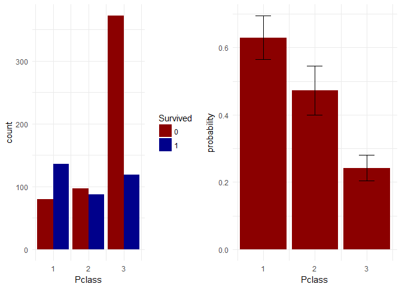

### 4.3 Sex

Also, the gender seems to be an important predictor. Females have a far
greater probability to survive than males.

    summary_Sex = full %>% slice(1:891) %>% 
      summarySE(measurevar="Survived", groupvars=c("Sex"))

    SP1 = full %>% slice(1:891) %>% 
      ggplot(aes(x = Sex, fill = factor(Survived))) +
      geom_bar(stat = "count", position = "stack") +
      scale_fill_manual(values=c("darkred", "darkblue")) +
      labs(fill = "Survived") +
      theme_minimal()

    SP2 = summary_Sex %>%
      ggplot(aes(x = Sex, y = Survived)) +
      geom_bar(stat = "identity", fill = "darkred") +
      geom_errorbar(aes(ymin=Survived-ci, ymax=Survived+ci), width=.3)+
      labs(y = "probability") +
      theme_minimal()

    grid.arrange(SP1, SP2, ncol = 2)

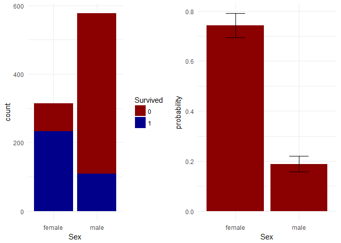

### 4.4 Name (Title)

The variable Name contains the first name, the last name and the title.
Especially the title provides the opportunity to get some information
which goes beyond the gender of the passengers. For example, Master has
a greater probability to survive then Mr.

    full = full %>% separate(Name, into = c("Last", "First"), sep = ",") %>% 
      separate(First, into = c("Title", "First"), sep = ". ",extra = "merge", fill = "left") %>%
      mutate(Title = trimws(Title, which = c("both")))

    full %>%
      slice(1:891) %>%
      group_by(Survived) %>%
      count(Title) %>%
      ggplot(aes(x = reorder(Title, n), y = n, fill = factor(Survived))) +
      geom_bar(stat = "identity", position = "dodge") +
      labs(x = "Title", y = "n", fill = "Survived") +
      scale_fill_manual(values=c("darkred", "darkblue")) +
      coord_flip() +
      theme_minimal()

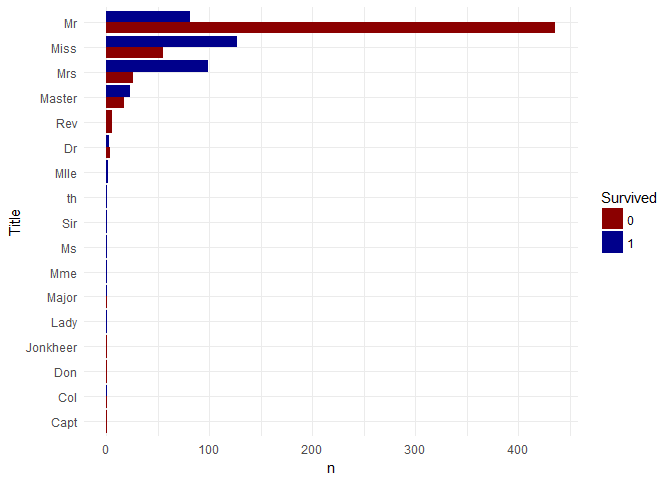

    full = full %>%
      group_by(Title) %>%
      mutate(sd_title = mean(Age, na.rm = T)) %>%
      ungroup() %>%
      mutate(Age = ifelse(is.na(Age == T ), sd_title, Age))

Since there are a lot of rare titles, they will be merged to avoid
overfitting on the test set.

    # Merging Miss and Mlle because they have the same meaning. 
    full = full %>% mutate(Title = ifelse(Title == "Mlle", "Miss", Title))

    # Merging Mme and Mrs because they have the same meaning. 
    full = full %>% mutate(Title = ifelse(Title == "Mme", "Mrs", Title))

    # Mergining the rare titles. 
    full = full %>% mutate(Title = ifelse(Title == "Don" |
                                          Title == "Dona"|
                                          Title == "th" |
                                          Title == "Ms" |
                                          Title == "Lady" |
                                          Title == "Jonkheer" |
                                          Title == "Col" |
                                          Title == "Major" |
                                          Title == "Sir" |
                                          Title == "Dr" |
                                          Title == "Rev" |
                                          Title == "Capt", "Other", Title))

    summary_title = full %>% slice(1:891) %>% summarySE(measurevar="Survived", groupvars=c("Title"))

    PT1 = full %>%
      slice(1:891) %>%
      ggplot(aes(x = Title, fill = factor(Survived))) +
      geom_bar(stat = "count", position = "dodge") +
      scale_fill_manual(values=c("darkred", "darkblue")) +
      labs(fill = "Survived") +
      theme_minimal()

    PT2 = summary_title %>%
      ggplot(aes(x = Title, y = Survived)) +
      geom_bar(stat = "identity", fill = "darkred") +
      geom_errorbar(aes(ymin=Survived-ci, ymax=Survived+ci), width=.3)+
      labs(y = "probability") +
      theme_minimal()

    grid.arrange(PT1, PT2, ncol = 2)

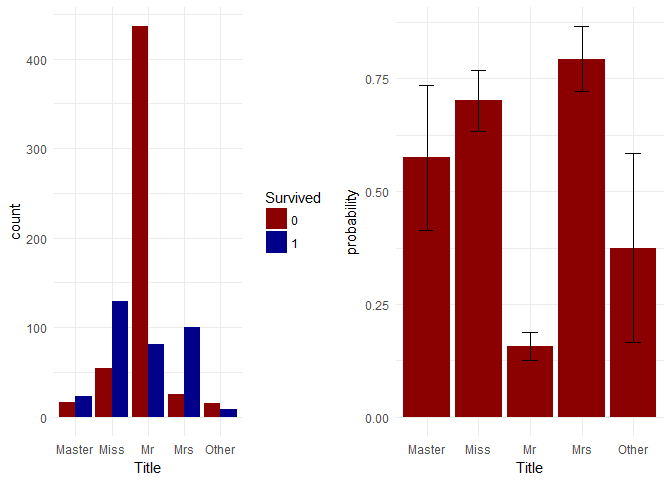

### 4.5 SibSp & Parch (FamilySize)

Sibsp and Parch are complementary to each other and can be merged to the
Family Size. In general, smaller families have a greater chance to
survive then large families. If someone travels alone the the chance to
survive is relatively small.

    full = full %>% mutate(FamilySize = SibSp + Parch + 1)

    summary_FamilySize = full %>% slice(1:891) %>% 
      summarySE(measurevar="Survived", groupvars=c("FamilySize"))

    FSP1 = full %>% slice(1:891) %>% 
      ggplot(aes(x = FamilySize, fill = factor(Survived))) +
      geom_bar(stat = "count", position = "dodge") +
      labs(fill = "Survived") +
      scale_fill_manual(values=c("darkred", "darkblue")) +
      theme_minimal()

    FSP2 = summary_FamilySize %>%
      ggplot(aes(x = FamilySize, y = Survived)) +
      geom_errorbar(aes(ymin=Survived-ci, ymax=Survived+ci), width=.1) +
      geom_line() +
      geom_point() +
      theme_minimal()

    grid.arrange(FSP1, FSP2, ncol = 1)

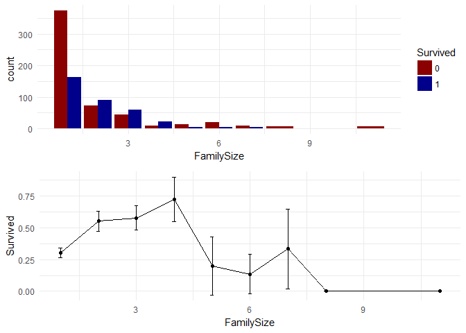

### 4.6 Ticket

The meaning of the ticket number isn't clear. However, there are some
duplicated ticket numbers in the data set. There are 713 unique values
while the other values occur more than once.

    full %>% 
      slice(1:891) %>%
      group_by(Ticket) %>%
      summarise(nTicket = n()) %>%
      select(nTicket) %>%
      table() %>%
      as.data.frame() %>%
      rename("TicketValues" = Freq) %>%
      rename("n" = ".") %>%
      kable("markdown")

<table>
<thead>
<tr class="header">
<th align="left">n</th>
<th align="right">TicketValues</th>
</tr>
</thead>
<tbody>
<tr class="odd">
<td align="left">1</td>
<td align="right">547</td>
</tr>
<tr class="even">
<td align="left">2</td>
<td align="right">94</td>
</tr>
<tr class="odd">
<td align="left">3</td>
<td align="right">21</td>
</tr>
<tr class="even">
<td align="left">4</td>
<td align="right">11</td>
</tr>
<tr class="odd">
<td align="left">5</td>
<td align="right">2</td>
</tr>
<tr class="even">
<td align="left">6</td>
<td align="right">3</td>
</tr>
<tr class="odd">
<td align="left">7</td>
<td align="right">3</td>
</tr>
</tbody>
</table>

Duplicates could mean that the people booked together which indicates
some kind of relationship between them. As you can see, the probability
to survive increases if the people have duplicated ticket numbers.

    full = full %>% 
      group_by(Ticket) %>% 
      mutate(nTicket= n()) %>%
      ungroup() %>%
      mutate(DuplicatedTicket = ifelse(nTicket > 1, "Yes", "No")) 

    summary_ticket = full %>% slice(1:891) %>% 
      summarySE(measurevar="Survived", groupvars=c("DuplicatedTicket"))

    TP1 = full %>% slice(1:891) %>% 
      ggplot(aes(x = DuplicatedTicket, fill = factor(Survived))) +
      geom_bar(stat = "count", position = "stack") +
      labs(fill = "Survived") +
      scale_fill_manual(values=c("darkred", "darkblue")) +
      theme_minimal()

    TP2 = summary_ticket %>%
      ggplot(aes(x = DuplicatedTicket, y = Survived)) +
      geom_bar(stat = "identity", fill = "darkred") +
      geom_errorbar(aes(ymin=Survived-ci, ymax=Survived+ci), width=.3)+
      labs(y = "probability") +
      theme_minimal()

    grid.arrange(TP1, TP2, ncol = 2)

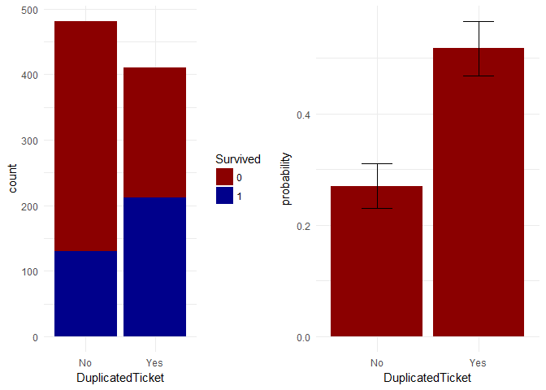

### 4.7 Fare

A high fare is a predictor to survive (especially if the fare is quite
high) where a low fare is a predictor to die. However, the destribution
is quiet left-skewed.

    FP1 = full %>% slice(1:891) %>% 
      ggplot(aes(x = Fare, fill = factor(Survived))) +
      geom_density(alpha = 0.7) +
      labs(fill = "Survived") +
      scale_fill_manual(values=c("darkred", "darkblue")) +
      theme_minimal()

    FP2 = full %>% slice(1:891) %>% 
      ggplot(aes(x = Fare)) +
      geom_histogram(color = "black", fill = "darkred") +
      geom_vline(aes(xintercept = mean(Fare)), linetype="dotted",size=1)+
      theme_minimal()

    grid.arrange(FP1, FP2)

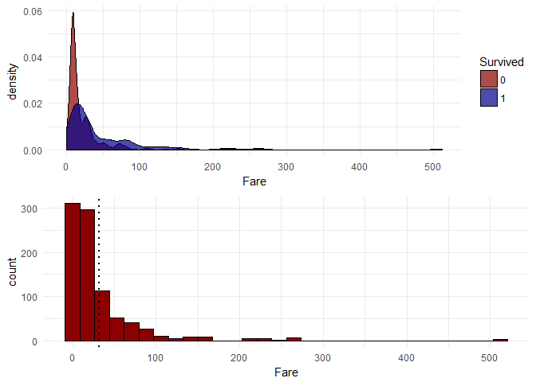

Because of the distribution, the missing value will be replaced with the
median.

    full = full %>% mutate(Fare = ifelse(is.na(Fare) == T, median(Fare, na.rm = T), Fare))

### 4.8 Cabin

Like the ticket variable, there are some duplicates in the data. There
are 107 unique values, while the other values occur more than once. 1014
is the count of the NA value which means the passenger has no cabin.

    full %>% 
      group_by(Cabin) %>%
      summarise(nCabin = n()) %>%
      select(nCabin) %>%
      table() %>%
      as.data.frame() %>%
      rename("CabinValues" = Freq) %>%
      rename("n" = ".") %>%
      kable("markdown")

<table>
<thead>
<tr class="header">
<th align="left">n</th>
<th align="right">CabinValues</th>
</tr>
</thead>
<tbody>
<tr class="odd">
<td align="left">1</td>
<td align="right">107</td>
</tr>
<tr class="even">
<td align="left">2</td>
<td align="right">63</td>
</tr>
<tr class="odd">
<td align="left">3</td>
<td align="right">6</td>
</tr>
<tr class="even">
<td align="left">4</td>
<td align="right">7</td>
</tr>
<tr class="odd">
<td align="left">5</td>
<td align="right">2</td>
</tr>
<tr class="even">
<td align="left">6</td>
<td align="right">1</td>
</tr>
<tr class="odd">
<td align="left">1014</td>
<td align="right">1</td>
</tr>
</tbody>
</table>

In this case, it could be interesting to investigate if there is a
difference between the passengers who stay together in a cabin or not.
As you can see, if a passenger has no cabin the probability to survive
is quite low. On the other hand, if the passengers stay together in a
cabin the probability to survive increase.

    full = full %>% 
      group_by(Cabin) %>%
      mutate(n_cabin = n()) %>%
      ungroup() %>%
      mutate(CabinMembers = ifelse(n_cabin == 1, "alone",
                            ifelse(n_cabin == 1014, "noCabin", "together"))) 

    summary_cabin_members = full %>% slice(1:891) %>% 
      summarySE(measurevar="Survived", groupvars=c("CabinMembers"))

    CM1 = full %>%
      slice(1:891) %>%
      ggplot(aes(x = CabinMembers, fill = factor(Survived))) +
      geom_bar(stat = "count", position = "stack") +
      scale_fill_manual(values=c("darkred", "darkblue")) +
      labs(fill = "Survived") +
      theme_minimal() 

    CM2 = summary_cabin_members %>%
      ggplot(aes(x = CabinMembers, y = Survived)) +
      geom_bar(stat = "identity", fill = "darkred") +
      geom_errorbar(aes(ymin=Survived-ci, ymax=Survived+ci), width=.3)+
      labs(y = "probability") +
      theme_minimal()

    grid.arrange(CM1, CM2, ncol = 2)

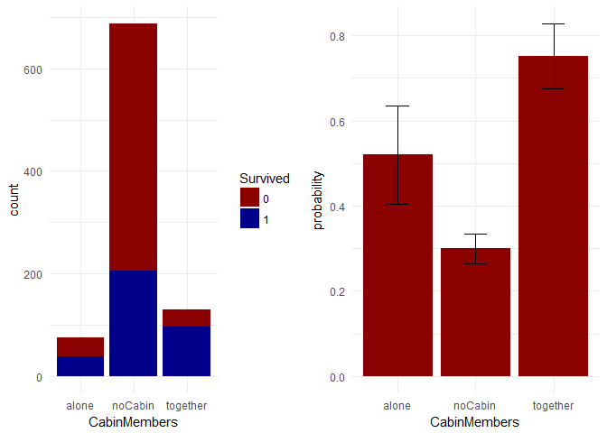

### 4.9 Embarked

Embarked is related to the place of embarkation. "C" is a predictor to
survive where "S" is a predictor to die.

    summary_embarked = full %>% slice(1:891) %>% 
      summarySE(measurevar="Survived", groupvars=c("Embarked"))

    EP1 = full %>% slice(1:891) %>% 
      ggplot(aes(x = Embarked, fill = factor(Survived))) +
      geom_bar(stat = "count", position = "stack") +
      labs(fill = "Survived") +
      scale_fill_manual(values=c("darkred", "darkblue")) +
      theme_minimal()

    EP2 = summary_embarked %>%
      ggplot(aes(x = Embarked, y = Survived)) +
      geom_bar(stat = "identity", fill = "darkred") +
      geom_errorbar(aes(ymin=Survived-ci, ymax=Survived+ci), width=.3)+
      labs(y = "probability") +
      theme_minimal()

    grid.arrange(EP1, EP2, ncol = 2)

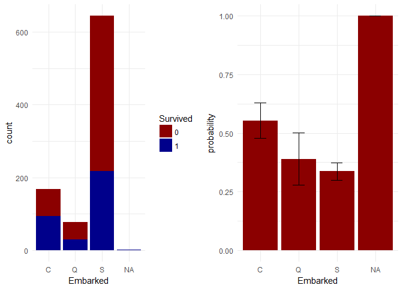

Embarked has two missing values which only occur in the train set. Since
those two passengers survived the Value "C" will be imputed.

    full %>% slice(1:891) %>%
      filter(is.na(Embarked) == T) %>%
      nrow()

    ## [1] 2

    full = full %>% mutate(Embarked = ifelse(is.na(Embarked) == T, "C", Embarked))

### 4.10 Age

If you look at the age of the passengers you can see, that especially
the younger passengers had a high probability to survive.

    AP1 = full %>%
      slice(1:891) %>%
      ggplot(aes(x = Age, fill = factor(Survived))) +
      scale_fill_manual(values=c("darkred", "darkblue")) +
      geom_density(alpha = 0.7) +
      labs(fill = "Survived") +
      theme_minimal()

    AP2 = full %>% slice(1:891) %>%
      ggplot(aes(x = Age)) +
      geom_histogram(color = "black", fill = "darkred", bins = 30) +
      geom_vline(aes(xintercept = mean(Age)), linetype="dotted",size=1)+
      theme_minimal()

    grid.arrange(AP1, AP2, ncol = 2)

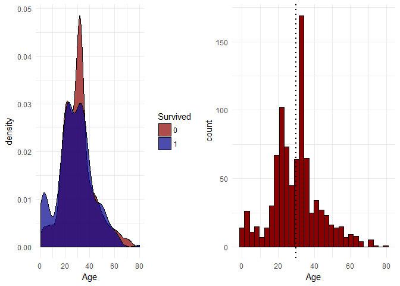

However, the variable has a decent amount of missing values. It seems
not possible to replace the values without adding noise to this
variable. Trying to replace the missing values with a random forest
leads to RMSE of ~10 years which is quite high. So, this variable will
not be used in the further process.

    imp_dat_age = full %>% dplyr::select(Survived, Pclass, Title, Sex, Fare, Embarked, FamilySize, DuplicatedTicket, CabinMembers, Age)

    imp_dat_age = imp_dat_age %>% mutate_if(is.character, as.factor)

    imputeLrn = makeLearner("regr.randomForest", fix.factors.prediction = TRUE)

    imp = mlr::impute(obj=imp_dat_age, target = "Survived", cols = list(Age = imputeLearner(imputeLrn)))

    mean(sqrt(imp$desc$impute$Age$args$model$learner.model$mse))

    ## [1] 9.878592

5 Feature selection
-------------------

After the exploratory data analyses and the preprocessing let´s take a
look at the relationship between and the target variable and the
features. Title is the strongest predictor, where Embarked is the
weekest. However, all predictors have a noticeable influence on the
target variable.

    full_fin = full %>% select(Survived, Pclass, Title, Sex, Fare, Embarked, FamilySize, DuplicatedTicket, CabinMembers)

    full_fin = full_fin %>% mutate_if(is.character, as.factor)

    full_fin = full_fin %>% mutate(Survived = as.factor(Survived))

    final_train <- full_fin[1:891,]

    final_test <-  full_fin[892:1309,]

    train_task = makeClassifTask(data = final_train, target = "Survived")

    test_task = makeClassifTask(data = final_test, target = "Survived")

    fv = generateFilterValuesData(train_task, method = c("chi.squared"))
    plotFilterValues(fv)

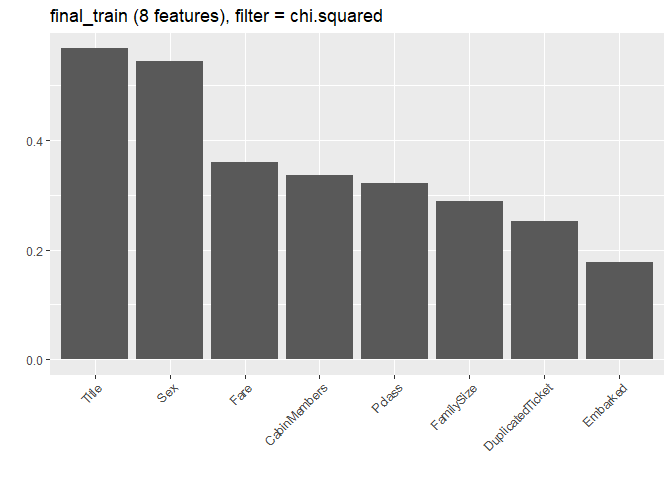

6 Model Building
----------------

For modeling an enseble of 6 potential models will be used.

6.1 RF
------

The first model is a Random Forest classifier.

    rf = makeLearner("classif.randomForest", 
                     predict.type = "prob")

    ps = makeParamSet(makeIntegerParam("mtry", lower = 1, upper = 8))

    ctrl = makeTuneControlGrid()

    rdesc = makeResampleDesc("RepCV",
                             folds = 10,
                             reps = 3,
                             stratify = T) 

    set.seed(3)
    rf_tune = tuneParams(learner  = rf, 
                         par.set = ps, 
                         task =train_task, 
                         resampling = rdesc, 
                         show.info = FALSE,
                         control = ctrl, 
                         measures = acc)

    rf_tune$x

    ## $mtry
    ## [1] 3

    rf_tune$y

    ## acc.test.mean 
    ##     0.8376389

6.2 KNN
-------

-   The second model is a K-Nearest-Neighbor classifier.

<!-- -->

    knn = makeLearner("classif.kknn", 
                      predict.type = "prob")

    ps = makeParamSet(
      makeIntegerParam("k", lower = 1, upper = 150),
      makeNumericParam("distance", lower = 0, upper = 100))

    mbo.ctrl = makeMBOControl()
    mbo.ctrl = setMBOControlTermination(mbo.ctrl, iters = 10)
    ctrl = makeTuneControlMBO(mbo.control = mbo.ctrl)

    rdesc = makeResampleDesc("RepCV",
                             folds = 10,
                             reps = 3,
                             stratify = T) 

    set.seed(3)
    knn_tune = tuneParams(learner = knn, 
                             par.set = ps,
                             task = train_task, 
                             resampling = rdesc,
                             control = ctrl, 
                             show.info = FALSE, 
                             measures = list(acc))

    knn_tune$x

    ## $k
    ## [1] 31
    ## 
    ## $distance
    ## [1] 24.60748

    knn_tune$y

    ## acc.test.mean 
    ##     0.8335234

6.3 Deep Learning
-----------------

The thrid model is single-hidden-layer neural network.

    lrn_dl = makeLearner("classif.nnet", 
                         predict.type = "prob",
                         par.vals = list(MaxNWts = 5000))

    params = makeParamSet(
      makeIntegerParam("size", lower = 1, upper = 200),
      makeNumericParam("decay", lower = 0, upper = 1))

    mbo.ctrl <- makeMBOControl()
    mbo.ctrl <- setMBOControlTermination(mbo.ctrl, iters = 10)
    ctrl <- makeTuneControlMBO(mbo.control = mbo.ctrl)

    rdesc = makeResampleDesc("CV", 
                             iters = 10,
                             stratify = T)

    set.seed(3)
    dl_tune = tuneParams(learner = lrn_dl, 
                         par.set = params,
                         task = train_task, 
                         resampling = rdesc,
                         control = ctrl, 
                         show.info = FALSE, 
                         measures = list(acc))

    dl_tune$x

    ## $size
    ## [1] 76
    ## 
    ## $decay
    ## [1] 0.2604239

    dl_tune$y

    ## acc.test.mean 
    ##     0.8361423

6.4 GBM
-------

The fourth model is a Gradient Boosting Machine.

    lrn_gbm = makeLearner("classif.gbm", 
                         predict.type = "prob",
                         par.vals = list(shrinkage = 0.01))

    getParamSet("classif.gbm")
    params = makeParamSet(
      makeIntegerParam("n.trees", lower = 1, upper = 2500),
      makeIntegerParam("interaction.depth", lower = 1, upper = 12),
      makeIntegerParam("n.minobsinnode", lower = 1, upper = 10))

    mbo.ctrl <- makeMBOControl()
    mbo.ctrl <- setMBOControlTermination(mbo.ctrl, iters = 30)
    ctrl <- makeTuneControlMBO(mbo.control = mbo.ctrl)

    rdesc = makeResampleDesc("RepCV", 
                             folds = 10,
                             reps = 3,
                             stratify = T)

    set.seed(3)
    gbm_tune = tuneParams(learner = lrn_gbm, 
                         par.set = params,
                         task = train_task, 
                         resampling = rdesc,
                         control = ctrl, 
                         show.info = FALSE, 
                         measures = list(acc))

    gbm_tune$x

    ## $n.trees
    ## [1] 1962
    ## 
    ## $interaction.depth
    ## [1] 7
    ## 
    ## $n.minobsinnode
    ## [1] 1

    gbm_tune$y

    ## acc.test.mean 
    ##     0.8390996

6.5 SVM
-------

The fifth model is a Support Vector Machine with a radial kernel.

    lrn_svm = makeLearner("classif.svm", 
                         predict.type = "prob")

    lrn_svm = makePreprocWrapperCaret(lrn_svm, ppc.center = TRUE, ppc.scale = TRUE)

    params = makeParamSet(
      makeNumericParam("cost", lower = 2^-5, upper = 2^15),
      makeNumericParam("gamma", lower = 2^-15, upper = 2^3))

    mbo.ctrl <- makeMBOControl()
    mbo.ctrl <- setMBOControlTermination(mbo.ctrl, iters = 10)
    ctrl <- makeTuneControlMBO(mbo.control = mbo.ctrl)

    rdesc = makeResampleDesc("RepCV", 
                             folds = 10,
                             reps = 3, 
                             stratify = T)

    set.seed(3)
    svm_tune = tuneParams(learner = lrn_svm, 
                         par.set = params,
                         task = train_task, 
                         resampling = rdesc,
                         control = ctrl, 
                         show.info = FALSE, 
                         measures = list(acc))

    svm_tune$x

    ## $cost
    ## [1] 0.618451
    ## 
    ## $gamma
    ## [1] 1.848632

    svm_tune$y

    ## acc.test.mean 
    ##     0.8297695

6.6 Glmnet
----------

-   The six model is an elastic net regression.

<!-- -->

    getParamSet("classif.randomForest")
    lrn_glm = makeLearner("classif.glmnet", 
                         predict.type = "prob")

    params = makeParamSet(
      makeNumericParam("alpha", lower = 0, upper = 1),
      makeNumericParam("lambda", lower = 0, upper = 1))

    mbo.ctrl = makeMBOControl()
    mbo.ctrl = setMBOControlTermination(mbo.ctrl, iters = 10)
    ctrl = makeTuneControlMBO(mbo.control = mbo.ctrl)

    rdesc = makeResampleDesc("RepCV", 
                             folds = 10,
                             reps = 3,
                             stratify = T)

    set.seed(3)
    glm_tune = tuneParams(learner = lrn_glm, 
                          par.set = params,
                          task = train_task, 
                          resampling = rdesc,
                          control = ctrl, 
                          show.info = FALSE, 
                          measures = list(acc))

    glm_tune$x

    ## $alpha
    ## [1] 0.7702295
    ## 
    ## $lambda
    ## [1] 1.847733e-05

    glm_tune$y

    ## acc.test.mean 
    ##     0.8349964

6.7 Model evaluation
--------------------

To evaluate the model performance a benchmark experiemnt will be used.

    rf_mod = setHyperPars(rf, par.vals = rf_tune$x)

    knn_mod = setHyperPars(knn, par.vals = knn_tune$x)

    dl_mod = setHyperPars(lrn_dl, par.vals = dl_tune$x)

    glmnet_mod = setHyperPars(lrn_glm, par.vals = glm_tune$x)

    gbm_mod = setHyperPars(lrn_gbm, par.vals = gbm_tune$x)

    svm_mod = setHyperPars(lrn_svm, par.vals = svm_tune$x)

    lrns = list(rf_mod,gbm_mod, svm_mod, knn_mod, glmnet_mod, dl_mod)

    set.seed(3)
    rdesc = makeResampleDesc("RepCV",
                             folds = 10,
                             reps = 3, 
                             stratify = T,
                             predict = "both")

    bmr = benchmark(lrns, train_task, rdesc, measures = list(acc))

    lc = generateLearningCurveData(learners = lrns, 
                                    task = train_task,
                                    percs = seq(0.1, 1, by = 0.1),
                                    measures = list(acc, setAggregation(acc, train.mean)),
                                    resampling = rdesc,
                                    show.info = FALSE)

As you can see, all models get similar results. Overall, the random
forest achieves the highest accuracy where the neuronal network achieves
the lowest accuracy.

    modperf <- cbind(rf_perf = bmr$results$final_train$classif.randomForest$aggr,
                     glm_perf = bmr$results$final_train$classif.glmnet$aggr,
                     dl_perf = bmr$results$final_train$classif.nnet$aggr,
                     gbm_perf = bmr$results$final_train$classif.gbm$aggr,
                     svm_perf = bmr$results$final_train$classif.svm.preproc$aggr,
                     knn_perf = bmr$results$final_train$classif.kknn$aggr)

    as.data.frame(modperf) %>%
      kable("markdown")

<table>
<thead>
<tr class="header">
<th align="left"></th>
<th align="right">rf_perf</th>
<th align="right">glm_perf</th>
<th align="right">dl_perf</th>
<th align="right">gbm_perf</th>
<th align="right">svm_perf</th>
<th align="right">knn_perf</th>
</tr>
</thead>
<tbody>
<tr class="odd">
<td align="left">acc.test.mean</td>
<td align="right">0.8398779</td>
<td align="right">0.8349964</td>
<td align="right">0.8256497</td>
<td align="right">0.8364652</td>
<td align="right">0.829395</td>
<td align="right">0.8335234</td>
</tr>
</tbody>
</table>

Le´ts take a look at the learning curves. Except Glmnet all models tend
to overfit the data. On the other hand all models also tend to to
underfit the data. That is not surprising since the data set is quiet
small and there are only a few features.

    plotLearningCurve(lc, facet = "learner")

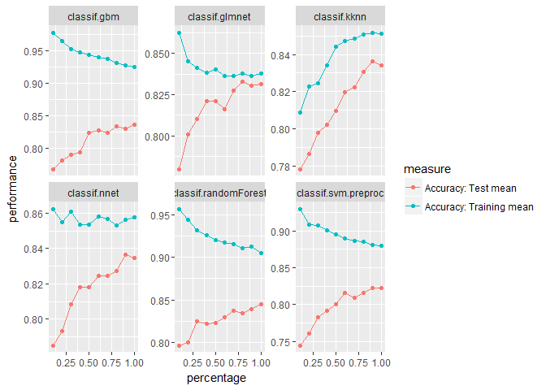

Lets´t take a look at the correlation between the models. The
correlation between Rf, SVM, KNN and GLM is in an acceptable range (&lt;
0.75). So, those four models will be used for the final model.

    modcor <- cbind(rf_res = bmr$results$final_train$classif.randomForest$measures.test$acc,
                    glm_res = bmr$results$final_train$classif.glmnet$measures.test$acc,
                    dl_res = bmr$results$final_train$classif.nnet$measures.test$acc,
                    gbm_res = bmr$results$final_train$classif.gbm$measures.test$acc,
                    svm_res = bmr$results$final_train$classif.svm$measures.test$acc,
                    knn_res = bmr$results$final_train$classif.kknn$measures.test$acc)

    cor(modcor) %>% 
      kable("markdown")

<table>
<thead>
<tr class="header">
<th align="left"></th>
<th align="right">rf_res</th>
<th align="right">glm_res</th>
<th align="right">dl_res</th>
<th align="right">gbm_res</th>
<th align="right">svm_res</th>
<th align="right">knn_res</th>
</tr>
</thead>
<tbody>
<tr class="odd">
<td align="left">rf_res</td>
<td align="right">1.0000000</td>
<td align="right">0.7488342</td>
<td align="right">0.7533775</td>
<td align="right">0.8401654</td>
<td align="right">0.6056244</td>
<td align="right">0.6660474</td>
</tr>
<tr class="even">
<td align="left">glm_res</td>
<td align="right">0.7488342</td>
<td align="right">1.0000000</td>
<td align="right">0.7786139</td>
<td align="right">0.6563122</td>
<td align="right">0.7231413</td>
<td align="right">0.7272524</td>
</tr>
<tr class="odd">
<td align="left">dl_res</td>
<td align="right">0.7533775</td>
<td align="right">0.7786139</td>
<td align="right">1.0000000</td>
<td align="right">0.7575893</td>
<td align="right">0.7209604</td>
<td align="right">0.7451583</td>
</tr>
<tr class="even">
<td align="left">gbm_res</td>
<td align="right">0.8401654</td>
<td align="right">0.6563122</td>
<td align="right">0.7575893</td>
<td align="right">1.0000000</td>
<td align="right">0.5525400</td>
<td align="right">0.6237655</td>
</tr>
<tr class="odd">
<td align="left">svm_res</td>
<td align="right">0.6056244</td>
<td align="right">0.7231413</td>
<td align="right">0.7209604</td>
<td align="right">0.5525400</td>
<td align="right">1.0000000</td>
<td align="right">0.7326772</td>
</tr>
<tr class="even">
<td align="left">knn_res</td>
<td align="right">0.6660474</td>
<td align="right">0.7272524</td>
<td align="right">0.7451583</td>
<td align="right">0.6237655</td>
<td align="right">0.7326772</td>
<td align="right">1.0000000</td>
</tr>
</tbody>
</table>

The final model will be stacked through averaging of the predictions.
Since the performance of the models is quite similar this seems to a
good choice to reduce the overfitting and enhance their performance on
the test set.

    stack = makeStackedLearner(base.learners = list(rf_mod, svm_mod, knn_mod, glmnet_mod),
                                predict.type = "prob",
                                method = "average")

    model = mlr::train(stack, train_task)

    pred = predict(model, test_task)

    submit = data.frame(PassengerId = test$PassengerId, Survived = pred$data$response)

    write.csv(submit, file = "submit.csv", row.names = FALSE)
